# Personal Landing Page

*A modern, responsive personal portfolio website built with Next.js 15 and React 19*

[](https://nextjs.org)
[](https://react.dev)
[](https://www.typescriptlang.org)
[](https://tailwindcss.com)
[](https://vercel.com)

---

## Table of Contents

- [System Architecture](#system-architecture)
- [Features](#features)
- [Tech Stack](#tech-stack)
- [Project Stats](#project-stats)
- [Getting Started](#getting-started)
- [Configuration](#configuration)
- [Project Structure](#project-structure)
- [Deployment](#deployment)

---

## System Architecture

```mermaid
flowchart TB
    subgraph Client["Frontend Layer"]
        direction TB
        Hero[Hero Section] --> About[About Section]
        About --> Timeline[Timeline Section]
        Timeline --> Skills[Skills Section]
        Skills --> Services[Three Tier Section]
        Services --> CTA[CTA Section]
        CTA --> Footer[Footer]
    end

    subgraph UI["UI Components Layer"]
        direction LR
        Button[Button]
        Card[Card]
        Badge[Badge]
        Globe[3D Globe]
        ScrollArea[Scroll Area]
    end

    subgraph Core["Core Utilities"]
        direction LR
        Utils[utils.ts]
        Theme[Theme Provider]
        Analytics[Vercel Analytics]
    end

    subgraph Frameworks["Framework & Libraries"]
        direction LR
        NextJS[Next.js 15]
        React[React 19]
        Radix[Radix UI]
        Three[Three.js / Drei]
    end

    subgraph Deployment["Deployment"]
        direction LR
        Vercel[Vercel Platform]
        Git[Git Repository]
    end

    Client --> UI
    UI --> Core
    Core --> Frameworks
    Frameworks --> Deployment
```



---

## Features

### Core Features
- **Responsive Design** - Fully responsive layout that works on all devices
- **Dark Mode Support** - Built-in dark/light theme with system preference detection
- **3D Interactive Globe** - Interactive Three.js globe component for visual appeal
- **Animated Timeline** - Horizontal timeline showcasing journey/experience
- **Skills Display** - Visual skills section with modern card design
- **Three Tier Services** - Tiered service/project showcase section
- **Call to Action** - Engaging CTA section with contact prompt
- **SEO Optimized** - Built-in Vercel Analytics for performance tracking

### UI Components
- Custom button component with multiple variants
- Card component for content containers
- Badge component for labels/tags
- Scroll area for overflow content
- 3D Globe component (Three.js + React Three Fiber)
- Theme provider for dark mode management

### Design Highlights
- **Modern aesthetics** with Tailwind CSS 4
- **Smooth animations** using CSS transitions
- **Clean typography** with Geist font
- **Visual hierarchy** with proper spacing and contrast

---

## Tech Stack

### Frontend
- **Framework**: [Next.js 15](https://nextjs.org) - React full-stack framework
- **Language**: [TypeScript 5](https://www.typescriptlang.org) - Type-safe JavaScript
- **UI Library**: [React 19](https://react.dev) - Modern React with hooks
- **Styling**: [Tailwind CSS 4](https://tailwindcss.com) - Utility-first CSS framework

### UI Component Libraries
- **Radix UI** - Accessible component primitives (15+ components)
- **Lucide React** - Beautiful & consistent icons
- **Embla Carousel** - Touch-friendly carousel component
- **Recharts** - Composable charting library

### 3D & Animations
- **Three.js** - 3D JavaScript library
- **@react-three/fiber** - React renderer for Three.js
- **@react-three/drei** - Useful helpers for react-three-fiber
- **Motion** - Modern animation library

### Form & Validation
- **React Hook Form** - Performance-focused form library
- **Zod** - TypeScript-first schema validation
- **@hookform/resolvers** - Zod resolvers for React Hook Form

### Development Tools
- **PostCSS** - CSS transformations
- **Autoprefixer** - CSS vendor prefixes
- **Tailwind CSS Animate** - Animation utilities for Tailwind

### Deployment & Analytics
- **Vercel** - Frontend cloud platform
- **@vercel/analytics** - Web analytics

---

## Project Stats

| Metric | Value |
|--------|-------|
| **Total Dependencies** | 781 packages |
| **Production Dependencies** | 70+ packages |
| **Dev Dependencies** | 8 packages |
| **Main Framework** | Next.js 15.2.4 |
| **React Version** | 19.2.5 |
| **TypeScript Version** | 5.x |
| **Tailwind CSS Version** | 4.1.9 |

### Package Highlights
- **Radix UI Components**: 40+ accessible UI primitives
- **Icons**: 450+ icons via Lucide React
- **Bundle Size**: Optimized with code splitting via Next.js

---

## Getting Started

### Prerequisites

Ensure you have the following installed:

- **Node.js** (v18 or higher recommended)
- **npm** or **pnpm** (package manager)

### Installation

```bash
# Install dependencies
npm install

# Or with pnpm
pnpm install
```

### Development

```bash
# Start development server
npm run dev

# Access at http://localhost:3000
```

### Build

```bash
# Create production build
npm run build

# Start production server
npm run start
```

### Linting

```bash
# Run ESLint
npm run lint
```

---

## Configuration

### Environment Variables

Create a `.env.local` file for local development:

```env
# Analytics (optional)
NEXT_PUBLIC_VERCEL_ANALYTICS_ID=your-analytics-id
```

### Key Configuration Files

| File | Purpose |
|------|---------|
| `next.config.mjs` | Next.js configuration |
| `tsconfig.json` | TypeScript configuration |
| `postcss.config.mjs` | PostCSS configuration |
| `tailwind.config.ts` | Tailwind CSS configuration |
| `components.json` | shadcn/ui component registry |

### Theme Configuration

The project uses `next-themes` for theme management. Theme can be configured in:

```typescript
// components/theme-provider.tsx
```

### Customizing Styles

Global styles are defined in:

```typescript
// app/globals.css
```

---

## Project Structure

```
personal-landing-page/
├── app/                    # Next.js App Router
│   ├── page.tsx           # Main page (Home)
│   ├── layout.tsx         # Root layout
│   └── globals.css        # Global styles
├── components/            # React components
│   ├── ui/               # Reusable UI components
│   │   ├── button.tsx
│   │   ├── card.tsx
│   │   ├── badge.tsx
│   │   ├── globe.tsx
│   │   └── scroll-area.tsx
│   ├── hero-section.tsx
│   ├── about-section.tsx
│   ├── timeline-section.tsx
│   ├── skills-section.tsx
│   ├── three-tier-section.tsx
│   ├── cta-section.tsx
│   ├── footer.tsx
│   ├── theme-provider.tsx
│   ├── globe-demo.tsx
│   └── horizontal-timeline.tsx
├── lib/                   # Utility functions
│   └── utils.ts          # cn() helper for Tailwind
├── data/                  # Static data files
├── styles/               # Additional styles
├── public/               # Static assets
├── package.json          # Dependencies
├── tsconfig.json         # TypeScript config
├── next.config.mjs       # Next.js config
├── postcss.config.mjs    # PostCSS config
└── tailwind.config.ts    # Tailwind config
```

---

## Deployment

### Vercel (Recommended)

The project is pre-configured for Vercel deployment:

1. **Connect Repository** to Vercel
2. **Automatic Deployments** on push to main branch
3. **Custom Domain** configuration available in Vercel dashboard

**Live URL**: [https://vercel.com/gileb64375-5584s-projects/v0-personal-landing-page](https://vercel.com/gileb64375-5584s-projects/v0-personal-landing-page)

### Manual Deployment

```bash
# Build the project
npm run build

# Deploy to Vercel
vercel deploy

# Or for production
vercel deploy --prod
```

---

## Contributing

1. Fork the repository
2. Create a feature branch (`git checkout -b feature/amazing-feature`)
3. Commit your changes (`git commit -m 'Add amazing feature'`)
4. Push to the branch (`git push origin feature/amazing-feature`)
5. Open a Pull Request

---

## License

This project is for personal use. All rights reserved.

---

## Acknowledgments

- Built with [v0.app](https://v0.app) - AI-powered UI builder
- UI components from [shadcn/ui](https://ui.shadcn.com)
- Icons from [Lucide](https://lucide.dev)
- 3D graphics powered by [Three.js](https://threejs.org)